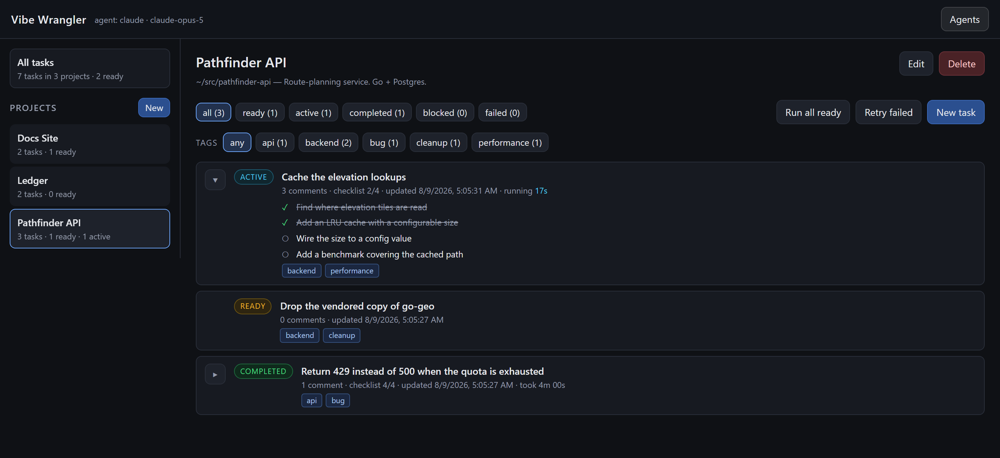

# Vibe Wrangler

A lightweight web app for managing **projects** and **tasks** that a **coding-agent CLI** works on for you.

It is built as a general harness for driving agent CLIs — the app owns the board, the git isolation, the
process supervision and the progress reporting, and treats the agent itself as a swappable command it
shells out to. Three are supported — **Claude Code**, **OpenAI Codex** and **Grok Build**, each with its own
[providers and models](#harnesses-providers--models) — and every task can name the one it wants. Everything
that differs between them — the flags, how the prompt is handed over, and how to read their JSON event
streams — lives in `harnesses.js`; adding a fourth is an entry in that list and nothing else.

The point: you keep a clean, human-readable board of work. The agent picks up tasks, does the work, and
reports back in short, user-level comments — you never have to wade through tool calls, diffs, or token noise
unless you actually want to.

```
Projects  ──▶  Tasks  ──▶  Comments
                 │             ▲
                 └── agent ────┘
```



## Features

- **Projects** — create / edit / delete. Each project points at a working directory on disk (that's where the agent runs).
- **Tasks** — create / edit / delete, grouped and filterable by status. Each is numbered from `#1`
  within its project. A number is retired when its task is deleted, so it never comes to mean
  something else later.
- **Tags** — label tasks with anything you like (`bug`, `backend`, `v2`). Tags are normalized (trimmed,
  lower-cased, de-duplicated) so `Backend` and `backend ` are the same tag.
- **Right-click a task** to toggle review tags on and off without opening it — `needs review`,
  `reviewed` and `verified` to begin with. **New tag…** adds your own, and it stays on the menu for
  every task from then on, whether or not anything currently carries it.
- **All tasks view** — one board showing every task across every project, filterable by tag *and* status.
  Useful for "show me everything tagged `release` no matter which repo it lives in".
- **Statuses**
  - `ready` — queued for the agent to pick up
  - `active` — the agent is working on it right now
  - `completed` — the agent finished
  - **anything else** (`blocked`, `on hold`, `idea`, …) — user-defined; the agent ignores these
- **Comments** — an append-only conversation per task. The agent writes progress notes while it works and a
  summary when it finishes. You can add your own comments too (review notes, test results, follow-ups) —
  and on a task that has already finished, a comment sets it back to active and the agent continues. See
  [reactivating a closed task](#reactivating-a-closed-task).
- **Attachments** — paste a screenshot straight into a task description or a comment, drop files onto
  either box, or use **Attach files**. Images render inline; everything else becomes a download link.
  The agent sees each attachment as a path to a real file on disk, so it can open your mock-up, log or
  spec rather than being told one exists.
- **Checklists** — the agent breaks each task into sub-tasks up front and ticks them off as it goes, so you
  can see how far through it is rather than just "active". A task's checklist opens itself on the board
  while the agent is working and folds away once it stops; the triangle beside any task overrides that
  either way. Starting a new run reveals the fresh checklist again.
- **Run timer** — a live elapsed clock while a task is active, and the final duration once it finishes.
- **Raw logs** — the full technical transcript of each agent run is saved to disk and linked from the task,
  so it's there when you need it and out of the way when you don't.
- **Retry failed** — a run that fails leaves the task in `failed` with its work parked on a branch.
  **Retry failed** re-runs every failed task in the project; the retry gets a *new* branch, so the
  branch holding the earlier attempt's work is never deleted out from under you.
- **Agent performance** — a chart of the grades you have given, one line per agent. Each point is that
  agent's *average* grade for a day, so a busy day reads as one mark rather than a spike of five; once
  the history runs past 50 days the points become weekly averages instead. A day (or week) an agent was
  not used leaves a gap in its line rather than a straight line drawn across the silence.
- **Agents** — a dialog listing every agent process the app knows about, with a Stop button for each.
  This includes agents inherited from an earlier run of the app, not just ones this instance started.
- **Harness, provider & model** — **Settings** (under the ☰ menu, alongside **About**) picks the three
  every task runs with by default; a task can name its own instead. A task's dropdowns open on the
  current default, and leaving them there means the task *follows* that default rather than
  snapshotting it, so changing it later moves the task too. Change one and only that one is pinned.
- **Give each new task a harness at random** — a tickbox in **Settings**. With it on, every task you
  create is dealt one of the harnesses by lot, on its own **Native** provider and top model, and keeps
  it: the draw is written onto the task, so a retry runs the same one and the grade it earns stays
  attached to it. Grade a batch of tasks this way and the **Agent performance** chart is a like-for-like
  comparison of the harnesses instead of a record of whichever one happened to be the default. The
  draw happens as the **New task** dialog opens, so its three dropdowns show you the harness you were
  dealt rather than the default — and changing any of them overrides the draw, so a task you want on a
  particular harness is still one dropdown away.
- **Model providers** — a harness's models are grouped by where they come from. Every harness offers
  **Native** (its own vendor's models); Grok Build also offers **OpenRouter** and **Ollama**, so you can
  run a task on a hosted third-party model or on one running locally. Picking one is all you do — the app
  writes the model alias Grok needs into its config file before the run starts. See
  [harnesses, providers & models](#harnesses-providers--models) for the full list.
- **Live** — the board updates itself. There is no Refresh button because there is nothing to refresh:
  the server pushes a notification whenever anything changes and every open tab refetches.
- **Local & private** — everything lives in a single SQLite file. No cloud, and no API keys unless you
  choose a provider that needs one.

## Harnesses, providers & models

Three choices, each narrowing the last: a **harness** is the CLI that gets shelled out to, a **provider** is
whose endpoint that CLI is pointed at, and a **model** is what answers. Settings picks the trio every task
runs with by default; a task can name its own.

| Harness | CLI | Provider | Models |
| --- | --- | --- | --- |
| **Claude Code** | `claude` | **Native** — Anthropic | Opus 5, Fable 5, Sonnet 5, Haiku 4.5 |
| **OpenAI Codex** | `codex` | **Native** — OpenAI | GPT-5.6 Sol, GPT-5.6 Terra, GPT-5.6 Luna, GPT-5.3 Codex Spark |
| **Grok Build** | `grok` | **Native** — xAI | Grok 4.6, Grok 4.5 |
| | | **OpenRouter** | DeepSeek V4 Flash 0731, MiMo-V2.5, GLM 5.2, GPT-5.6 Luna, Hy3 |
| | | **Ollama** | whatever you have pulled — read from Ollama itself, not a list kept here |

Claude Code and Codex offer only their own vendor's models: neither CLI has a supported way to reach a
third-party endpoint, so there is nothing to expose. Grok Build does, through an alias in its own config
file, which is why the other two providers hang off it.

The head of each list is the fallback — the model a task gets when it has named a harness and a provider but
not a model, which is also why a newly released model goes to the top rather than the bottom.

**Ollama's models are not listed in the source.** Which ones exist depends entirely on what you have pulled,
so any list written here would be wrong on every machine that made different choices. The app asks Ollama
each time the catalogue is fetched and shows what it answers. If Ollama isn't running, the last known list
stays put — a stopped server is not the same as nothing installed, and emptying the dropdown would be its
own kind of lie.

Two things are checked *before* a worktree and a branch are made for the run, because both otherwise reach
you as a bare status code from somebody else's server, minutes in:

- **A missing key** — choosing an OpenRouter model with no key in the environment stops the run with the
  variable name to set, rather than a `401` from the far end.
- **A model Ollama doesn't have** — Ollama will not fetch a model on demand, so picking one that isn't
  pulled stops the run with the `ollama pull` command to run and a list of what *is* installed.

Adding a model is one line in `harnesses.js`. The catalogue is read into memory at startup, so a model added
to the source shows up in the dropdowns only after a restart — Ollama's list is the one part rebuilt on
every request.

## Why a CLI (not the API)

The agent is invoked by shelling out to its CLI in non-interactive mode. That means it uses
**your existing subscription login** — there is no `ANTHROPIC_API_KEY` or `OPENAI_API_KEY` to manage and no
per-token billing. (Routing Grok Build at OpenRouter is the one exception, and it's opt-in: that's a
metered account you point it at deliberately.) It also keeps the integration surface tiny: an agent is a
command, a working directory and a stream of output, which is why supporting a second CLI was an entry in
`harnesses.js` rather than a rewrite.

## Requirements

- **Node.js 22+** (uses the built-in `node:sqlite` module — no `npm install`, zero dependencies)
- **At least one agent CLI** on your `PATH`, already logged in:
  - **Claude Code** (`claude` → `/login`)
  - **OpenAI Codex** (`codex login`)
  - **Grok Build** (`grok` → `/login`)

  You only need the one you intend to run; the others simply won't start if selected.
- **Optional, for Grok Build's other providers:**
  - **OpenRouter** — an `OPENROUTER_API_KEY` in your environment (`OPEN_ROUTER_KEY`,
    `OPENROUTER_KEY` and `OPENROUTER_API_TOKEN` are accepted too). Set it *before* starting the app:
    a variable added afterwards is invisible to a process that is already running.
  - **Ollama** — [Ollama](https://ollama.com) running locally. The dropdown lists what you have pulled, so
    pull first (`ollama pull qwen3-coder`) and it appears; Ollama does not download a model on demand, and
    picking one it doesn't have stops the run before it starts rather than failing partway.

## Quick start

> ⚠️ **Before you start:** the agent runs with its approval prompts disabled and will edit files and run
> commands in your project directory without asking. Read [Permissions](#permissions-read-this) first.

Windows:

```bat
run.bat
```

macOS / Linux:

```sh
./run.sh
```

Either script checks your prerequisites, starts the server and opens <http://localhost:3000> in your browser.
To use a different port:

```bat
set PORT=4000 && run.bat
```

```sh
PORT=4000 ./run.sh
```

## How a task gets worked

1. You create a project pointing at a repo directory.
2. You add a task with a title and a description of what you want done — and, if you don't want the
   default, the harness, provider and model it should run on.
3. Set the task to **ready** and hit **Run** (or **Run all ready** on the project).
4. The app flips the task to **active**, resolves which harness, provider and model the task runs on (its
   own choice, or the default from Settings), makes sure that harness is set up to reach that provider, and
   launches the CLI in the project directory with the prompt on stdin — or in a file, for a CLI that can't
   read stdin.
5. While it works, the app watches the agent's output for three prefixes and drops everything else:

   | Line | Becomes |
   | --- | --- |
   | `NOTE: <sentence>` | a user-level comment on the task |
   | `PLAN: <sub-task>` | a new checklist item |
   | `DONE: <sub-task>` | that checklist item, ticked off |

   `DONE:` matches on words rather than exact text, so the agent rewording an item slightly still ticks
   the right box. The checklist is cleared at the start of each run, so it always describes the run you
   are looking at.
6. When it's done, the final summary is saved as a comment and the task flips to **completed** (or back to
   `ready` with an error comment if the run failed).

Exiting cleanly is not taken as having done the work. A run that reported nothing at all — no summary, no
note, not one checklist item ticked — has almost certainly answered with its plan and stopped, so instead of
being completed it is started again with that plan handed back to it. Only if it goes silent a second time
is the task marked `failed`, and whatever it did write stays on its branch either way. See
[when an agent plans and stops](#when-an-agent-plans-and-stops).

You then review the comments, test the change, and either close it out or add a follow-up task.

A run is normally finalized when the CLI exits. It doesn't always get that far: a background process the
agent started — a dev server, a poll loop — inherits the output pipe and can hold it open long after the
agent has said its piece. So the terminal event the CLI prints is treated as the outcome, and if no
exit follows within `AGENT_EXIT_GRACE_MS` the leftovers are killed and the run is closed out on the
strength of that result rather than left `active` indefinitely.

## Reactivating a closed task

A task that reached **completed**, **failed** or **cancelled** can still have something left to say —
*what did you actually change? why did you stop? please also fix the other file.* There is no run coming
that would pick that up, so a comment on those statuses reopens the task: it goes back to **active**,
the elapsed clock keeps the time already spent and starts ticking again, and the agent continues as if
this were a regular run. When it is done it closes the task the same way — a short answer in the thread,
or a code fix that is committed and merged.

A few things stay from the run that finished, rather than starting over:

- **The clock continues.** The time already on the timer is kept; only the idle gap while the task was
  closed is skipped, so the live number is prior work plus this session.
- **The checklist is left as it was**, so the agent can tick remaining items rather than planning from
  scratch.
- **The exchange is appended to that run's transcript**, so **Raw log** still shows one continuous
  record of the run and everything asked about it afterwards.

A note on a task in any other status is just filed, as before: `ready` and `active` tasks have an agent
reaching their thread anyway, so there is nothing to spend a run on.

Pressing **Run** on a closed task is still a fresh attempt: new clock, blank checklist, new branch. A
comment is the way to continue the same conversation.

## Running several tasks at once

If a project directory is a git repo, each task gets **its own branch and its own checkout** (a
`git worktree`), so two agents can work the same repo simultaneously without tripping over each other.
Your own working copy is never touched while they run.

```
main ──┬── llm-task/12   (worktree: data/worktrees/p1-task-12)
       └── llm-task/13   (worktree: data/worktrees/p1-task-13)
```

When a task finishes, the app:

1. Commits everything in that task's worktree.
2. Merges the current base branch **into the task branch**, inside the worktree — so if two tasks
   changed the same lines, the conflict happens somewhere harmless.
3. On conflict, hands it straight back to the agent: *resolve this, keep both changes, run the tests.*
   There is no approval prompt — the agent is trusted to merge and verify.
4. Fast-forwards your branch onto the result. A fast-forward is the only merge your working copy ever
   sees, so it can't leave you with a conflicted tree, and git refuses outright rather than clobbering
   uncommitted work.
5. Deletes the worktree and the task branch.

If any of that fails, the task is marked `failed` and a comment tells you which `llm-task/<id>` branch
still holds the work — nothing is ever thrown away.

Projects that **aren't** git repos have nowhere to isolate to, so their tasks are queued and run one at
a time instead. A task waiting its turn shows a `queued` pill on the board and offers Stop, which takes
it back out of the queue. The queue is held in memory, so restarting the app clears it — anything still
waiting has to be run again.

## Surviving a restart

Every agent process is recorded in the database before it starts — its pid, its worktree, its branch.
When the app starts up it walks that list and reattaches to any process still alive, so closing the app
doesn't orphan an agent you can no longer see or stop.

Reattachment is deliberately conservative. A restart severs the pipe carrying the agent's output, and
there is no way to get it back — so an adopted agent's progress notes are gone, and when it exits the
app cannot tell whether it succeeded. It commits whatever the agent left in the worktree, parks it on
the task branch, marks the task `failed`, and tells you where the work is. Nothing is thrown away, and
nothing is merged on a guess.

A leftover reply from an older build (one that answered without reopening the task) is the one
exception: its answer was only ever going to reach the pipe that died with the app, so it is stopped
rather than adopted, and the thread is told to ask again. The closed task it was answering about is
left as it was. A comment that reopens a task is a regular run, so a restart treats it like any other.

Runs whose process is gone are closed out, and any task still marked `active` with no agent behind it
goes back to `ready`. Pids get recycled, so a recorded pid is only adopted when the process at that pid
still has the executable name we started — otherwise the app would happily adopt, and later kill, a
stranger's process.

## Staying current

`GET /api/events` is a server-sent event stream. Whenever a row changes, the server pushes a frame
saying only *something moved* — never what — and the browser refetches what it has on screen. Because
the payload is meaningless, a duplicated, reordered or dropped frame cannot corrupt anything, which is
what keeps this to one small file with no dependencies.

The notification is fired from a single place: a wrapper around the prepared-statement `run()` in
`db.js`. Every write in the app goes through it, so a new query cannot quietly forget to notify.

The server also greets each new connection with a frame before sending any real ones. `EventSource`
reconnects on its own, and that greeting makes it resync — so a dropped stream needs no reasoning
about what was missed while it was down.

## Configuration

Environment variables:

| Variable | Default | Meaning |
| --- | --- | --- |
| `PORT` | `3000` | HTTP port |
| `VIBE_WRANGLER_DB` | `./data/vibe_wrangler.db` | SQLite database file |
| `VIBE_WRANGLER_LOGS` | `./data/logs` | Directory for raw agent transcripts |
| `VIBE_WRANGLER_WORKTREES` | `./data/worktrees` | Where per-task git worktrees are checked out |
| `VIBE_WRANGLER_ATTACHMENTS` | `./data/attachments` | Where pasted and uploaded files are stored |
| `ATTACHMENT_MAX_BYTES` | `26214400` | Largest single upload accepted (25 MB) |
| `CLAUDE_BIN` | `claude` | Path to the Claude Code CLI |
| `CODEX_BIN` | `codex` | Path to the Codex CLI |
| `GROK_BIN` | `grok` | Path to the Grok Build CLI |
| `GROK_CONFIG` | `~/.grok/config.toml` | Grok's config file, where third-party model aliases are written |
| `GROK_MAX_TURNS` | `200` | Ceiling on the agent turns one Grok Build run may take |
| `AGENT_HARNESS` | `claude` | Default harness before one has been saved in Settings |
| `AGENT_PROVIDER` | first provider of that harness | Default provider before one has been saved in Settings |
| `AGENT_MODEL` | first model of that provider | Default model before one has been saved in Settings |
| `AGENT_EXIT_GRACE_MS` | `20000` | How long to wait for the CLI to exit after it reports its result |

`AGENT_HARNESS`, `AGENT_PROVIDER` and `AGENT_MODEL` are only a starting point: once you save Settings the
stored choice wins, because a default you picked in the app shouldn't be silently overridden by the
environment. Naming a harness, provider or model that no longer exists falls back to a working one rather
than failing the run.

The agents are invoked as:

```
claude -p --output-format stream-json --verbose --dangerously-skip-permissions --model <model>
codex exec --json --skip-git-repo-check --dangerously-bypass-approvals-and-sandbox --model <model> -
grok --prompt-file <file> --output-format streaming-json --permission-mode bypassPermissions --max-turns 200 --model <model>
```

Claude Code and Codex read the task prompt from stdin. Grok has no stdin mode and takes the prompt as an
argument, which a long description would overflow on Windows, so it gets a file written beside the run's log.
`--max-turns` is a ceiling on how far the agent may go, not a target; a run that exhausts it is reported as
failed rather than finished.

### When an agent plans and stops

Grok's loop ends on any message that carries no tool call, so a reply that is only a plan can end a run
before it starts. It happens intermittently and more often the larger the repository, and it is partly
model-side — [grok-4.5 is reported](https://github.com/OpenRouterTeam/docs/issues/176) to return narration
instead of a tool call above some context size — so no prompt makes it go away. Asking for the plan in the
same message as the first tool call helps (0 failures in 9 against 1 in 5 here), but the thing that actually
recovers the run is that a run reporting nothing at all — no summary, no note, not one item ticked — is
handed its own plan back and asked to carry it out, without anyone having to press the button again. A
second silent stop is treated as a real failure rather than retried again, and whatever the agent did write
stays on its branch either way.

### Third-party models

Grok only reaches an endpoint other than xAI's through a named alias in its own config file, so choosing an
OpenRouter or Ollama model means that alias has to exist before the CLI starts. The app writes it for you,
as a `[model.<name>]` block appended to `GROK_CONFIG`. An alias already in the file is left alone — it may
have been tuned by hand, and clobbering someone's credentials or context window would be worse than doing
nothing. The credential itself is never written: OpenRouter aliases point at `OPENROUTER_API_KEY` in your
environment, and Ollama needs none.

Because the alias names exactly one variable, a key kept under one of the other spellings people use is
copied into that name for the run rather than left to fail. If it is under none of them the run stops
before the CLI starts, saying which variable to set — the alternative is a bare `401 Missing Authentication
header` from the far end, arriving after the worktree and branch have already been made.

Deleting a block from that file is enough to have it rewritten from the app's defaults on the next run.

## Permissions (read this)

**Every harness runs with its approvals turned off** — `--dangerously-skip-permissions` for Claude Code,
`--dangerously-bypass-approvals-and-sandbox` for Codex, `--permission-mode bypassPermissions` for Grok Build.
Every action any of them would normally stop and ask you to approve — editing files, deleting them, running builds, running arbitrary shell commands, installing
packages, making network requests — happens automatically, with no prompt and no undo.

This is not a setting you can turn off here; it is the premise of the tool. The whole point is that tasks run
unattended while you are doing something else, and there is no terminal attached for anyone to approve a
prompt on. An agent blocked on a confirmation nobody will ever answer is an agent that hangs forever.

What that means in practice:

- **Only point projects at directories you are willing to lose.** Treat every project directory as
  disposable — committed, pushed, and backed up somewhere the agent cannot reach.
- **The blast radius is not limited to the project directory.** The agent runs shell commands as *you*, with
  your user's permissions and your credentials. It can reach anything you can: other repos, your home
  directory, your cloud CLI sessions, the internet.
- **Task descriptions are instructions to a process that will act on them.** Anything the agent reads —
  a task description, a file in the repo, a web page it fetches, a dependency's README — can influence what
  it does next. Don't paste in text you haven't read from a source you don't trust.
- **Run it somewhere you can afford to be wrong.** A VM, a container, or a dedicated machine is a far better
  home for this than your primary workstation.

Git isolation ([above](#running-several-tasks-at-once)) protects your *working copy* from concurrent agents.
It is not a security boundary and does nothing to contain a command the agent chooses to run.

## Project layout

```
server.js          HTTP server + JSON API
db.js              SQLite schema and queries
agent.js           Spawns the agent CLI and turns its output into comments and checklist ticks
harnesses.js       Harness catalogue: how each agent CLI is launched, set up, and how its events are read
git.js             Worktree / branch / merge plumbing for concurrent tasks
proc.js            Liveness, identity and tree-kill for agent processes
local.js           Starts and stops a project's local instance, and finds its fly URL
events.js          Server-sent change notifications that keep open tabs current
public/            Single-page front end (no build step, no framework)
test/smoke.js      End-to-end API test against a throwaway database
test/worktree.js   Two-agents-one-repo concurrency and merge-conflict test
data/              SQLite database, raw agent logs, task worktrees (git-ignored)
run.bat            Start the app on Windows
run.sh             Start the app on macOS / Linux
```

## Tests

```sh
npm test
```

Two suites, neither of which invokes a real agent CLI — both are fast and free.

- `test/smoke.js` spins the server up on a spare port against a temporary database and exercises the
  whole API: CRUD, tags, status filtering, cascade deletes, harness/provider/model selection, and the
  agent's failure paths.
- `test/worktree.js` builds throwaway git repos and runs two agents on one repo at the same time,
  using a scripted stand-in for the CLI. It checks that both changes land, that a genuine merge
  conflict is resolved without losing either side, that non-git projects fall back to a queue, and
  that a failed run leaves your checkout clean. It also comments on a finished task and checks the
  task goes active again, the clock keeps the time already spent, and the agent finishes as a regular run.

## API

| Method | Path | Purpose |
| --- | --- | --- |
| `GET` | `/api/projects` | List projects with task counts |
| `POST` | `/api/projects` | Create a project |
| `PUT` | `/api/projects/:id` | Update a project |
| `DELETE` | `/api/projects/:id` | Delete a project and its tasks |
| `GET` | `/api/projects/:id/tasks?status=&tag=` | List a project's tasks, optionally filtered |
| `GET` | `/api/tasks?status=&tag=` | List tasks across every project |
| `GET` | `/api/tags` | Every tag in use, with task counts |
| `GET` | `/api/quick-tags` | The tag set offered on a task's right-click menu |
| `POST` | `/api/quick-tags` | Add a tag to that set |
| `POST` | `/api/projects/:id/tasks` | Create a task |
| `GET` | `/api/tasks/:id` | Task detail with comments |
| `PUT` | `/api/tasks/:id` | Update a task |
| `DELETE` | `/api/tasks/:id` | Delete a task |
| `POST` | `/api/tasks/:id/comments` | Add a comment — on a closed task this reopens it and starts the agent, and the response says `replying: true` |
| `DELETE` | `/api/comments/:id` | Delete a comment |
| `POST` | `/api/attachments` | Upload a file — the body is the file, the name rides in `X-Filename` |
| `GET` | `/attachments/:file` | Serve an uploaded file back |
| `POST` | `/api/tasks/:id/run` | Hand the task to the agent |
| `POST` | `/api/tasks/:id/stop` | Stop a running agent |
| `POST` | `/api/projects/:id/run-ready` | Run every `ready` task in the project |
| `POST` | `/api/projects/:id/run-failed` | Retry every `failed` task in the project |
| `POST` | `/api/projects/:id/run-local` | Start the project's `run.bat` / `run.sh` |
| `POST` | `/api/projects/:id/stop-local` | Stop whatever is listening on the project's local port |
| `POST` | `/api/projects/:id/deploy` | Run `fly deploy` in the project directory |
| `GET` | `/api/agents` | Every agent process the app knows is running |
| `POST` | `/api/agents/:id/stop` | Terminate one of them |
| `GET` | `/api/tasks/:id/log` | Raw transcript of the last agent run |
| `GET` | `/api/statuses` | Known status values (built-in + user-defined) |
| `GET` | `/api/config` | App version and the harness catalogue: each harness, its providers, their models |
| `GET` | `/api/settings` | The default harness, provider and model, and whether new tasks are dealt one at random |
| `PUT` | `/api/settings` | Change them. `random` is optional; omitting it leaves the draw as it was |
| `GET` | `/api/events` | Change notification stream (server-sent events) |

## License

MIT — see [LICENSE](LICENSE).
